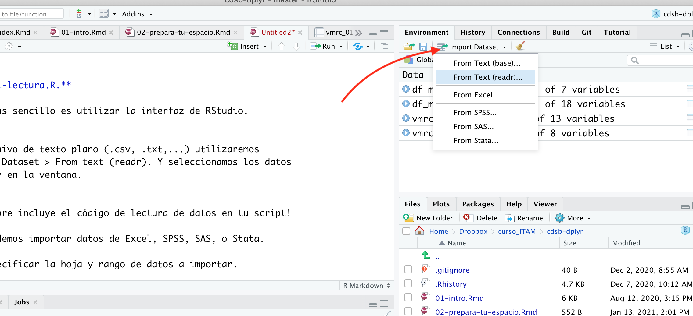

# Lectura de datos

Para leer datos lo más sencillo es utilizar la interfaz de RStudio. En el caso 
de un archivo de texto plano (.csv, .txt,...) utilizaremos 
Environment > Import Dataset > From text (readr). Y seleccionamos los datos 
que queremos importar en la ventana.



**Importante:** Siempre incluye el código de lectura de datos en tu script!

```{r}
library(readr)
df_muni <- read_csv("datos/df_municipios.csv")
df_muni
```


 Abre el script ejercicios.R y añade código para leer los datos de
educación a nivel municipal, ubicados en la carpeta df_edu.csv.

Usando la interfaz de RStudio también podemos importar datos de Excel, SPSS, 
SAS, o Stata. En Excel podemos especificar la hoja y rango de datos a importar.

```{r}
library(readxl)
women_school <- read_excel("datos/Years_in_school_women_25_plus.xlsx", 
                           sheet = "Data")
women_school
```

{width=20%}
