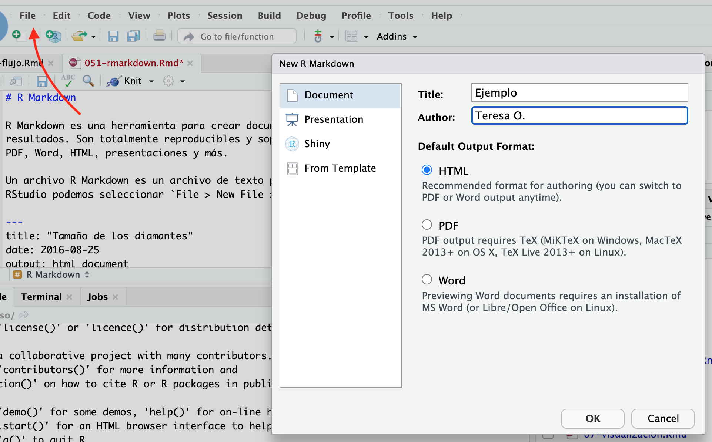

# R Markdown

R Markdown es una herramienta para crear documentos que combinan texto, código y
resultados. Son totalmente reproducibles y generan documentos de diferentes formatos:
PDF, Word, HTML, presentaciones y más.

Un archivo R Markdown es un archivo de texto plano que tiene la extensión .Rmd, en 
RStudio podemos seleccionar `File > New File > R Markdown` para generar un 
machote de un archivo R Markdown.




```{r setup, include = FALSE}
chunk <- "```"
inline <- function(x = "") paste0("`` `r ", x, "` ``")
library(tidyverse)
```

## Básicos de R Markdown {-}

El siguiente es un archivo de tipo R Markdown, es un archivo de texto plano
con terminación `.Rmd`:

```{r echo = FALSE, comment = ""}
cat(htmltools::includeText("rmarkdown/machote.Rmd"))
```

Los archivos R Markdown contienen tres tipos de contenido:

1. Un encabezado YAML (opcional) rodeado de ---

2. Bloques de código de R rodeado de ```.

3. Texto formateado con lenguaje Markdown (\# Encabezado e \_itálicas\_).

Cuando abres un archivo .Rmd, obtienes una interfaz con el código y el output 
intercalados. Puedes ejecutar cada bloque de código haciendo clic el ícono de *play*, o 
línea por línea como en un script de R usual. 

* Utiliza RStudio para crear un machote de un archivo R Markdown, selecciona tipo de 
salida HTML. Repite seleccionando PDF, ¿qué cambia en el archivo de texto .Rmd?

Cuando presionas Knit en RStudio, o con código puedes utilizar la función `knit` 
`knit("ejemplo.Rmd")`, se ejecutan todos los bloques de código y se genera un  documento markdown (.md) que incluye el código y su output. El archivo markdown es procesado entonces por pandoc que crea el archivo terminado, y pandoc puede crear las diferentes
salidas (Word, PDF, HTML) a partir del mismo archivo markdown.


### Markdown {-}

Las secciones de texto de un archivo R Markdown utilizan el lenguaje Markdown,
una colección simple de convenciones para dar formato a archivos de texto plano. 
La guía abajo, tomada de @r4ds, muestra como usar Markdown.

```
Formato de texto
------------------------------------------------------------

*cursiva*   ó _cursiva_
**negrita**   __negrita__
`code`
superscript^2^ y subscript~2~

Encabezados
------------------------------------------------------------

# Encabezado de primer nivel

## Encabezado de segundo nivel

### Encabezado de tercer nivel

Listas
------------------------------------------------------------

*   Elemento 1 en lista no enumerada

*   Elemento 2

    * Elemento 2a

    * Elemento 2b

1.  Elemento 1 en lista enumerada

1.  Elemento 2. La numeración se incrementa automáticamente en el output.

Enlaces e imágenes
------------------------------------------------------------

<http://ejemplo.com>

[texto del enlace](http://ejemplo.com)


Tablas 
------------------------------------------------------------

Primer encabezado     | Segundo encabezado
--------------------- | ---------------------
Contenido de la celda | Contenido de la celda
Contenido de la celda | Contenido de la celda

```

* Crea un documento R Markdown donde describas la ciudad en que naciste, debe
incluir al menos: 
1) encabezados de primer y segundo nivel, 2) enlaces, 3) formato de letras 
negritas o cursivas


### Bloques de código {-}

Para agregar código que se ejecutará en un archivo R Markdown se necesita
insertar un bloque de código, para ello podemos:

1. Usar el atajo `Cmd/Ctrl + Alt + I`

2. El botón *Insert* en la barra de edición de RStudio.

3. Escribir manualmente las comillas y corchetes: ` ```{r} ` y ` ``` `.

Por otra parte el atajo Cmd/Ctrl + Shift + Enter correrá todo el código del 
bloque.

* En el archivo R Markdown que creaste en el ejercicio anterior agrega un bloque 
de código que filtre la informacion de educación del municipio en que naciste.

* Agrega un bloque de código que genere una gráfica donde compares tu municipio con 
el resto de los de tu estado.

```{r}
library(estcomp)
df_edu
```

#### Opciones de bloques de código {-}

Los bloques de código pueden tener nombre y se puede pasar opciones a ellos.

* **Nombre del bloque:** Se escribe después del identificador de tipo de bloque
```` ```{r nombre-bloque} ```` y sirve para navegar con mayor facilidad los bloques, 
las gráficas producidas en los bloques tendrán nombres útiles, se puede conjuntar con 
el uso de caches cuando el código es costoso de ejecutar.

* **Opciones:** Los bloques de código se pueden personalizar con parámetros con opciones que se pasan en el encabezado del bloque: ```` ```{r nombre-bloque, echo = FALSE, error = TRUE} ````.
Hay más de 60 opciones
(lista completa aquí http://yihui.name/knitr/options/). Entre las usadas más 
frecuentemente están:
  
  + `eval = FALSE` el código no se evaluará. Y por consiguiente tampoco 
habrá resultados de ese bloque. Esta opción es útil cuando queremos mostrar código ejemplo o deshabilitar un bloque temporalmente.

  + `include = FALSE` evalúa el código pero no imprime el código ni los resultados. 

  + `echo = FALSE` oculta el código. Esta opción se utiliza para generar reportes 
reproducibles pero en los que el código no es de interés para el lector.
    
  + `message = FALSE` o `warning = FALSE` elimina los mensajes y alertas del reporte
final, por ejemplo, quizá no queremos que se impriman los mensajes al cargar 
paquetes o unir tablas.

  + `results = 'hide'` esconde los resultados; `fig.show = 'hide'` esconde las gráficas.

  + `error = TRUE` por defecto los reportes de R Markdown genera error y no se crean
cuando hay fallas en el código, la opción de `error = TRUE` permite que el proceso siga ignorando los errores.
  
  + `fig.width = 7, fig.height = 3` se utilizan para ajustar el tamaño de las gráficas.


* **Opciones globales:** En ocasiones buscamos modificar las opciones para todos los bloques de nuestro
documento, por ejemplo, cuando queremos ocultar el código de todos los bloques, u 
ocultar todos los mensajes de alerta.

```{r, eval=FALSE}
knitr::opts_chunk$set(
  echo = FALSE,
  warning = FALSE
)
```

* Agrega nombre a los bloques de código de tu documento R Markdown y experimenta con 
las opciones que acabamos de revisar.

#### Tablas {-}

Por defecto, R Markdown imprime `data frames` tal como se ven en la consola:

```{r}
filter(df_edu, state_code == "09")
```

Podemos darles formato adicional con la función `kable()` del paquete `knitr`.

```{r}
library(knitr)
filter(df_edu, state_code == "09", sex == "Total") |> 
  select(municipio_name, sex, pop_15, schoolyrs) |> 
  kable()
```

* Agrega una tabla a tu reporte (puedes usar nuevos datos) y usa la función `kable()`
para agregar formato a la tabla.


#### Código en el texto {-}

En ocasiones deseamos incluir información de los datos directamente en un párrafo, 
para esto usamos `r inline()`. Por ejemplo:

> Tenemos una muestra de `r inline('nrow(sample_2006)')` casillas. 
> En las cuales el PAN obtuvo el `r inline('100 * sum(sample_2006$pan) / sum(sample_2006$total)')` % de los votos

Cuando creamos el reporte los cálculos se insertan en el texto:

> Tenemos una muestra de 7200 casillas. 
> En las cuales el PAN obtuvo el 35.91703 % de los votos


Para insertar texto la función `format()` resulta útil pues permite ajustar
el número de dígitos en la salida, y que no pase como arriba, también podemos
usarla poner comas y mejorar la lectura:

```{r}
format(12.123893, digits = 3)
format(3452345, big.mark = ",")
```

* Agrega código en el texto de tu reporte.

#### Reportes con parámetros {-}

Los documentos de R Markdown pueden incluir parámetros, esto resulta útil
cuando quieres generar varios reportes con distintos valores de entrada, por 
ejemplo, un reporte por estado de la república, un reporte por trimestre, etc.

En este ejemplo queremos generar un reporte para cada estado:

```{r echo = FALSE, comment = ""}
cat(htmltools::includeText("rmarkdown/reporte_param.Rmd"))
```

Como vemos en el ejemplo de arriba los parámetros se acceden como una lista 
usando la notación `params$nombre`.

Para generar documentos de R Markdown con parámetros podemos usar la opción 
*Run with Parameters ...* en el menú del botón *Knit*, ó producir los 
reportes con código:

```
library(rmarkdown)
render("reporte_param.Rmd", params = list(estado = "01"))
```

Esta segunda opción suele ser más conveniente, tenemos un script desde el que
generamos los reportes. Por ejemplo, con la función `walk()`:

```
parametros <- tibble(
  codigo_edo = unique(df_edu$state_code),
  archivo = stringr::str_c("reporte-edo-", codigo_edo, ".html")
)

walk2(parametros$codigo_edo, parametros$archivo, 
      ~render(input = "rmarkdown/reporte_param.Rmd", params = list(estado = .x), 
              output_file = .y))
```

* Crea un script para generar reportes estatales.


### Recursos
 
* Revisa el acordeón de R Markdown en `Help > Cheatsheets > R Markdown Cheatsheet`

* Revisa la guía de referencia de R Markdown en `Help > Cheatsheets > R Markdown Reference Guide`

* El libro [R Markdown definitive guide](https://bookdown.org/yihui/rmarkdown/) escrito por Yihui Xie, J. J. Allaire, Garrett Grolemund es una excelente referencia.

* Visita la galería de ejemplos en https://rmarkdown.rstudio.com/gallery.html.


